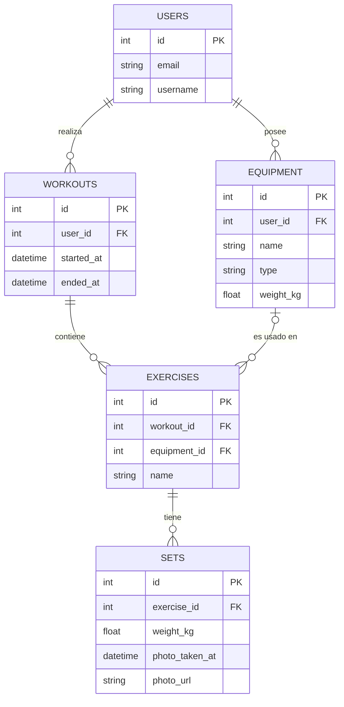

### Estructura de Tablas (Diccionario de Datos)

**Tabla: `users`** (Usuarios del sistema)
| Columna | Tipo de Dato (SQLAlchemy) | Restricciones / Detalles |
| :--- | :--- | :--- |
| `id` | Integer | **PK** (Primary Key), Auto-incremental |
| `email` | String(255) | Unique, Not Null |
| `username` | String(100) | Not Null |
| `hashed_password` | String(255) | Nullable |
| `created_at` | DateTime | Default: `datetime.utcnow` |

**Tabla: `equipment`** (Inventario del Home Gym)
| Columna | Tipo de Dato | Restricciones / Detalles |
| :--- | :--- | :--- |
| `id` | Integer | **PK**, Auto-incremental |
| `user_id` | Integer | **FK** (`users.id`), Not Null |
| `name` | String(100) | Not Null (Ej. "Disco Olímpico", "Barra") |
| `type` | String(50) | Not Null, Default: "other" (Enum) |
| `weight_kg` | Float | Not Null, Default: 0.0 |
| `quantity` | Integer | Not Null, Default: 1 |
| `notes` | Text | Nullable |
| `created_at` | DateTime | Default: `datetime.utcnow` |

**Tabla: `workouts`** (Sesiones de Entrenamiento)
| Columna | Tipo de Dato | Restricciones / Detalles |
| :--- | :--- | :--- |
| `id` | Integer | **PK**, Auto-incremental |
| `user_id` | Integer | **FK** (`users.id`), Not Null |
| `started_at` | DateTime | Not Null (Calculado con la 1ra foto - 3 min) |
| `ended_at` | DateTime | Nullable (Calculado con la última foto + 3 min) |
| `duration_minutes`| Float | Nullable |
| `notes` | Text | Nullable |
| `is_completed` | Integer | Default: 0 (Funciona como Booleano) |
| `created_at` | DateTime | Default: `datetime.utcnow` |

**Tabla: `exercises`** (Agrupación de series dentro del Workout)
| Columna | Tipo de Dato | Restricciones / Detalles |
| :--- | :--- | :--- |
| `id` | Integer | **PK**, Auto-incremental |
| `workout_id` | Integer | **FK** (`workouts.id`), Not Null |
| `name` | String(100) | Not Null (Ej. "Press Banca", "Sentadilla") |
| `equipment_id` | Integer | **FK** (`equipment.id`), Nullable |
| `order` | Integer | Not Null, Default: 0 (Orden del ejercicio en la sesión) |
| `notes` | Text | Nullable |
| `created_at` | DateTime | Default: `datetime.utcnow` |

**Tabla: `sets`** (Levantamientos / Análisis de Fotos)
| Columna | Tipo de Dato | Restricciones / Detalles |
| :--- | :--- | :--- |
| `id` | Integer | **PK**, Auto-incremental |
| `exercise_id` | Integer | **FK** (`exercises.id`), Not Null |
| `reps` | Integer | Nullable |
| `weight_kg` | Float | Nullable (Peso detectado por el Stub/YOLO) |
| `photo_url` | String(500) | Nullable (Ruta local o URL de la foto) |
| `photo_taken_at`| DateTime | Nullable (El Timestamp EXIF extraído) |
| `order` | Integer | Not Null, Default: 0 |
| `is_completed` | Integer | Default: 1 |
| `created_at` | DateTime | Default: `datetime.utcnow` |

---

### Modelo Entidad-Relación (MER)

### Modelo Relacional (MR)

*   **USERS** (**`id`**, `email`, `username`, `hashed_password`, `created_at`)
*   **EQUIPMENT** (**`id`**, `user_id` [FK->USERS.id], `name`, `type`, `weight_kg`, `quantity`, `notes`, `created_at`)
*   **WORKOUTS** (**`id`**, `user_id` [FK->USERS.id], `started_at`, `ended_at`, `duration_minutes`, `notes`, `is_completed`, `created_at`)
*   **EXERCISES** (**`id`**, `workout_id` [FK->WORKOUTS.id], `name`, `equipment_id` [FK->EQUIPMENT.id], `order`, `notes`, `created_at`)
*   **SETS** (**`id`**, `exercise_id` [FK->EXERCISES.id], `reps`, `weight_kg`, `photo_url`, `photo_taken_at`, `order`, `is_completed`, `created_at`)